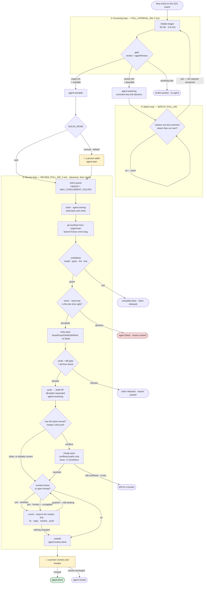
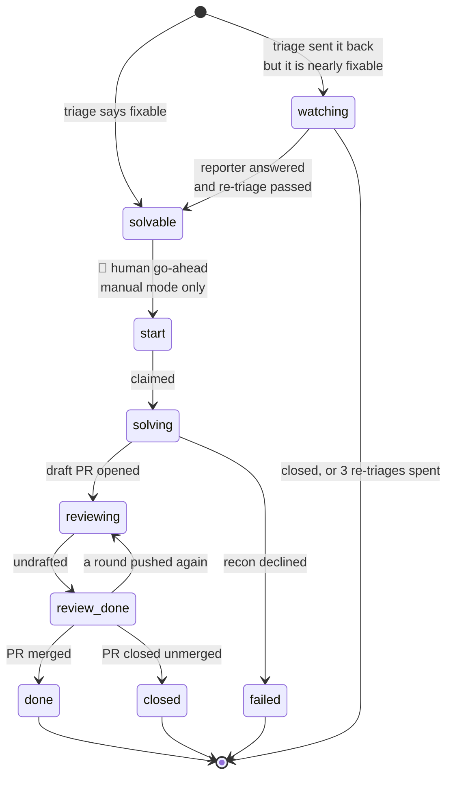

# the-jira-police

A service that watches the SSX Jira board, runs Storebrand's `/intake-triage` skill against every
new ticket, checks the verdict mechanically, and posts it back.

A **second queue** runs alongside it: tickets a triage assessment marked `agent:solvable`, waiting
to be fixed by an agent. That queue claims a ticket, fixes it in an isolated worktree under
mechanical verification, opens a draft pull request and works the review to a handover.

A **third loop** watches tickets triage sent back as nearly-solvable, and re-triages one when the
reporter answers — so a ticket that was one missing acceptance criterion away from being fixable
does not sit there unread.

**The daemon now claims and solves on its own**, as of 2026-09-06, with `SOLVE_ENABLED=true`. In
the default `manual` mode it still waits for a person to add `agent:start` to each ticket, which
is the one human step in the chain. **A human always merges** — there is no merge call anywhere in
this codebase.

> This paragraph said _"a person still starts every solve"_ and _"what the daemon does on its own
> is advance pull requests that already exist"_ until 2026-09-06, when both stopped being true.
> Recorded rather than quietly corrected: prose drifting away from behaviour is the defect class
> this service exists to catch, and the README is not exempt from it.

`ARCHITECTURE.md` is the design document — why grooming is three steps, which credential is
allowed to do what, and what is deliberately unbuilt. This file is how to run it.

---

## The whole flow

Three loops, one board. Everything the loops know is written on the ticket as a label, so the
state survives a restart, a wiped `state/`, and a second instance — and a person can read it.



**The two yellow boxes are the only places a person is required.** Everything else runs unattended.

### Five passes, five sessions

The boxes labelled recon, write, round and merge are separate `storecode` invocations of the
`agent-solve` skill, not turns of one conversation:

| Pass         | Tools                                | Given                            |
| ------------ | ------------------------------------ | -------------------------------- |
| `--recon`    | `Read` `Grep` `Glob` — **read-only** | the ticket                       |
| `--fix`      | …plus `Write` `Edit`                 | the recon verdict                |
| `--simplify` | same as `fix`                        | the diff, and **not** the ticket |
| `--review`   | same as `fix`                        | the reviewer's comments          |
| `--merge`    | same as `fix`                        | the conflicted paths only        |

**None of them has `Bash`**, so there is no git, no test runner and no package manager inside any
model session. The harness runs every command itself and reads exit codes; the model is never
asked whether the tests passed.

Separate sessions rather than five turns is the safety property: a pass cannot carry a capability
past the point it was granted for, and a pass that dies cannot leave a later one reasoning from
half a conversation. Recon runs first and its verdict is honoured — if it says stop, the fix pass
never starts and **no model gets write access for that ticket at all**. `--simplify` is given the
diff and not the ticket deliberately: showing it the requirement would invite it to reconsider the
change instead of the way the change is written.

### The labels are the state machine

Nothing is stored on disk about a solve. The ticket carries it:



`agent:solving` is written **before** any work starts — that single edit is the claim, and it is
what makes the queue idempotent across restarts and instances. `agent:reviewing` _replaces_ it, so
a pull request waiting on a human reviewer does not hold the only concurrency slot for days.
`agent:done` means **merged**, and is therefore the honest count of bugs this tool has fixed.

### What a full run looks like

SSX-3834, 2026-09-06 — the first ticket to travel the entire chain, with a person typing two
things: one reply, and one label.

| time  | event                                                             |
| ----- | ----------------------------------------------------------------- |
| 12:52 | ticket created                                                    |
| 12:55 | grooming tick picks it up · triage runs                           |
| 12:59 | **sent back** · `dor:gaps` · `agent:watching` · 3 blockers listed |
| 13:05 | 👤 reporter answers in a comment                                  |
| 13:11 | watch tick sees a non-bot comment · re-triages · `agent:solvable` |
| 13:15 | 👤 `agent:start` added                                            |
| 13:16 | claimed · worktree cut                                            |
| 13:21 | draft [PR #2662] opened · `agent:reviewing`                       |
| 13:24 | Copilot: 2 inline comments — a real `NaN` regression              |
| 13:28 | round 1 · fixed, replied, both threads resolved                   |
| 13:30 | Copilot approves                                                  |
| 13:31 | round 2 · no change · **undrafted** · `agent:review-done`         |

Claim to draft pull request: **5 minutes 36 seconds.**

[PR #2662]: https://github.com/storebrand-digital/buy-insurance-advisor-web/pull/2662

---

## Setup

Node ≥ 24 and pnpm ≥ 11. There is **no build step** — Node runs the TypeScript directly by
stripping types.

```bash
pnpm install
cp .env.example .env    # then fill in JIRA_EMAIL, JIRA_AUTH, VAULT_PATH
```

Those three are all grooming needs. **Solving needs three more with no defaults** —
`SOLVE_REPO_ROOT`, `SOLVE_REPOS` and `SOLVE_GITHUB_OWNER` — and each one is unset rather than
guessed because a default there is a privilege that survives being deleted from `.env`. See
Settings.

Check it without spending anything:

```bash
pnpm poll:once --dry-run
```

That does discovery only — no model call, no cost, no writes. It is the fastest way to find out
whether the credential and the JQL scope are right.

---

## Demo path

Five commands, in escalating order of what they touch. Nothing below writes to Jira unless the
command says so.

### 1. What would be triaged?

```bash
pnpm poll:once --dry-run
```

Lists the new tickets discovery found and stops. Free.

### 2. Triage one ticket, without posting

```bash
pnpm triage:once SSX-1234 --skill intake-triage
```

Runs the real skill — 3–8 minutes, **$1.56 measured** — writes `groomed/SSX-1234.md`, and posts
**nothing**. The report contains the verdict, the label delta, the DoR check, and the
**agent-fitness call** —
whether this ticket looks safely fixable by an agent, with the reasoning.

Add `--write` to actually post the comment and labels:

```bash
pnpm triage:once SSX-1234 --skill intake-triage --write
```

`--write` **decides** `WRITE_BACK` for that run rather than adding to it — typing it posts even
if `.env` says `false`, and omitting it previews even if `.env` says `true`. Both directions are
deliberate: an operator who does not type the flag cannot post to a shared ticket by inheriting a
setting they never looked at. There is no `--no-write`; preview is the default.

One exception: a stand-in skill (`mock-triage`, `live-triage-probe`) never posts, flag or not. A
rehearsal that comments on a real ticket is not a rehearsal.

### 3. What would the solve queue pick up?

```bash
SOLVE_ENABLED=true pnpm solve:once
cat groomed/solve-cycle.md
```

Reads the board, works out which tickets it would claim and the exact label edit each claim would
be, and writes it all to `groomed/solve-cycle.md`. **Changes nothing** — not a label, not a
branch, not a file.

The report carries the config the cycle ran under, both JQL queries verbatim so you can paste
them into Jira and check by hand, and every candidate with the decision made about it beside the
labels that decision was made from.

### 4. Watch a sent-back ticket, without posting

```bash
pnpm watch:once SSX-1234
```

Reads every ticket carrying `agent:watching` — or just the named one — and prints one of three
decisions per ticket: `RETRIAGE` with the comment or field change that triggered it, `DROP` with
the reason the watch is being given up, or `quiet`. Writes nothing. Add `--write` to act on it.

The trigger is deliberately _somebody else changed the ticket_, not _the ticket changed_: posting
a triage comment is itself a change, so the naive version re-triages forever at $1.56 a lap.

### 5. Run the daemon

```bash
pnpm start --skill mock-triage --interval 10s --for 1m
```

**Grooming only, unless you switch the others on.** `SOLVE_ENABLED` and `WATCH_ENABLED` both
default to false, and each one off means that loop is never constructed — not started-and-idle.
With both on, the daemon runs the full chain in the diagram above: it claims, solves, opens pull
requests, works reviews, and re-triages sent-back tickets, with no person between the steps except
`agent:start` and the merge.

The next section is how to work up to that.

---

## Running the daemon for real

`pnpm start` polls, triages and repeats until told to stop. Three flags override settings **for a
single run**, so a smoke test needs no edit to `.env` and leaves nothing behind in it:

| Flag                    | Overrides                      | Example                     |
| ----------------------- | ------------------------------ | --------------------------- |
| `--skill <name>`        | `SKILL_NAME`                   | `--skill live-triage-probe` |
| `--interval <duration>` | `POLL_INTERVAL_MS`             | `--interval 30s`            |
| `--for <duration>`      | nothing — bounds the whole run | `--for 4m`                  |

Durations take `ms`, `s`, `m`, `h`, or a bare millisecond count: `30s`, `4m`, `1.5m`, `2h`.

`--interval` moves the grooming loop only. The review loop reads `REVIEW_POLL_MS` and there is no
flag for it, which is deliberate: that cadence is how long a reviewer's reply waits, and shortening
a smoke test should not shorten the service's patience.

There is **no `--write` flag on the daemon.** Unlike `triage:once`, posting is controlled only by
`WRITE_BACK` in the environment. A long-running unattended process should not be able to acquire
write access from a shell history entry.

### Work up to it in four steps

Each step turns on one more real thing. Run each for a bounded `--for` and read the log before
going on.

**1 — the loop itself. Free, no Atlassian, no model.**

```bash
pnpm start --skill mock-triage --interval 10s --for 1m
```

`mock-triage` reads nothing and is given an empty tool allowlist. This exercises cadence, the
cursor, the state file, backoff and graceful shutdown, and costs nothing. If something is wrong
with the _service_, it is wrong here.

Expect one `cycle.done` per interval and a clean stop:

```
{"message":"service.start", …}
{"message":"poll.query",  …}
{"message":"cycle.done","found":1,"skipped":1,"triaged":0, …}
{"message":"cycle.done","found":1,"skipped":1,"triaged":0, …}
{"message":"shutdown.requested","reason":"deadline", …}
{"message":"service.stopped","cycles":2,"failures":0}
```

`found: 1, triaged: 0` is the normal result on a repeat run — the ticket was found and then
skipped because it is already in `seenKeys`. See _the cursor persists_ below.

**2 — a real subprocess and a real Atlassian session, still no verdicts.**

```bash
pnpm start --skill live-triage-probe --interval 30s --for 4m
```

`live-triage-probe` is a stand-in: it opens a genuine MCP session and reads the ticket, so it
proves the subprocess contract, MCP connectivity and the timeout path. It is **structurally
unable to post** — stand-in skills are pinned to preview no matter what `WRITE_BACK` says.

**3 — the real skill, previewing.**

```bash
FIRST_RUN_LOOKBACK_MINUTES=5 pnpm start --skill intake-triage --for 20m
```

Real triage, real cost — roughly **$1.56 and 3–8 minutes per ticket**. Reports land in
`groomed/`; nothing reaches Jira while `WRITE_BACK=false`, which is the default.

> This figure read `$0.11` here and in three arguments in `PLAN.md` until 2026-09-05, when a run
> was actually metered. It was wrong by **14×**, always in the cheap direction, and every cost
> argument built on it was understated by an order of magnitude. Quote measured numbers, and say
> when they were measured.

Name the skill on the command line even if `.env` already sets it. `SKILL_NAME` **defaults to
`mock-triage`**, deliberately — an unconfigured service must not be able to post — so a run that
omits the flag on a machine without that setting quietly produces mock verdicts, and mock output
is plausible enough to be believed. Stating it makes each step of this ladder self-contained.

Note `--interval` is the gap _between_ cycles, not a rate limit on triages: a cycle takes as long
as its tickets do, so `--interval 20s` with the real skill does not mean three triages a minute.

**4 — writing to the board.**

```bash
WRITE_BACK=true pnpm start --skill intake-triage --for 20m
```

Everything above, plus comments and labels on real tickets, as your own Jira user.

Both halves are required and neither is enough alone: a stand-in skill ignores `WRITE_BACK`
entirely, and the real skill with `WRITE_BACK=false` previews. Posting needs the real skill _and_
the setting.

### The two things that catch people out

**The lookback window on a first run.** With no state file the service looks back
`FIRST_RUN_LOOKBACK_MINUTES` (default 60). Widen it and you get _one paid triage per historical
issue_ in the window. Narrow it for a demo:

```bash
FIRST_RUN_LOOKBACK_MINUTES=5 pnpm start --for 10m
```

**The cursor persists.** `state/poll.json` holds the cursor and every key ever seen:

```json
{ "cursor": "2026-09-03T20:01:26.658+0200", "seenKeys": ["SSX-3813", "SSX-3814", "…"] }
```

A ticket in `seenKeys` is never triaged again, so a second demo run finds nothing. To replay:

```bash
rm state/poll.json          # full reset — re-triages everything in the lookback window
```

Both `state/` and `groomed/` are gitignored. The file is re-read at the start of every cycle
rather than held in memory, so editing it out of band — or running `poll:once` alongside — is
respected rather than clobbered.

### Stopping it

`Ctrl-C` (or `SIGTERM`, or closing the terminal) lets the current cycle finish, so a ticket
mid-triage is either completed and recorded or left untouched for next time. A **second** signal
exits immediately. Look for `service.stopped` in the log — its absence means the process died
rather than stopped.

---

## Demoing the solve queue end to end

The queue selects on labels, so a demo needs a ticket wearing them. It is staged on purpose:
three of these four observations should be empty, and that is what makes the fourth mean
something.

Pick a ticket in `SSX` / component `SSX Advisor`, not Done, carrying a `svc:<repo>` label naming
a repo on `SOLVE_REPOS`.

| Step | Do                                  | Expect in `groomed/solve-cycle.md`                                  |
| ---- | ----------------------------------- | ------------------------------------------------------------------- |
| 0    | Nothing — run it as a control       | `## The queue was empty`                                            |
| 1    | Add `agent:solvable` in the Jira UI | Still empty — the human gate is holding                             |
| 2    | Add `agent:start`                   | `## PLAN — SSX-1234` with the claim `+agent:solving` `-agent:start` |
| 3    | Remove both labels                  | Empty again                                                         |

Re-run `SOLVE_ENABLED=true pnpm solve:once` after each step.

**Add the labels however you like.** This paragraph used to say "in the Jira UI, not through the
MCP tool", because the only write path this service had replaced the whole label field and would
silently drop anything edited in between. It no longer does: `JiraClient.updateLabels` sends
Jira's own `update.labels.add` / `.remove` and can only ever name `agent:*`. See invariant 11 in
`ARCHITECTURE.md`.

The other two decision types need no board changes — both are env overrides on top of step 2:

```bash
# SKIP — eligible, but the repository is not allowed
SOLVE_ENABLED=true SOLVE_REPOS= pnpm solve:once

# WAIT — eligible and allowed, but no capacity this cycle
SOLVE_ENABLED=true MAX_CONCURRENT_SOLVES=0 pnpm solve:once
```

`groomed/solve-cycle.md` is a snapshot, replaced on every run. To keep a stage for comparison,
`cp` it somewhere between runs.

---

## Commands

| Command                                                | What it does                                                                                              | Writes?                     |
| ------------------------------------------------------ | --------------------------------------------------------------------------------------------------------- | --------------------------- |
| `pnpm poll:once --dry-run`                             | Discovery only. Free                                                                                      | no                          |
| `pnpm poll:once`                                       | One full grooming cycle                                                                                   | only with `WRITE_BACK=true` |
| `pnpm triage:once <KEY> --skill intake-triage`         | Triage one ticket, preview the result                                                                     | `groomed/<KEY>.md`          |
| `pnpm triage:once <KEY> --skill intake-triage --write` | …and post it. The flag decides `WRITE_BACK` on its own                                                    | Jira                        |
| `pnpm triage:once <KEY>`                               | Same, but the skill comes from `SKILL_NAME` — **which defaults to the mock**                              | `groomed/<KEY>.md`          |
| `pnpm solve:once`                                      | One solve cycle. Needs `SOLVE_ENABLED=true`                                                               | `groomed/solve-cycle.md`    |
| `pnpm bot:once <KEY> --review`                         | The whole chain on one ticket: triage, claim, solve, PR, rounds                                           | Jira **and** GitHub         |
| `pnpm watch:once`                                      | What the sendback watch would do to every `agent:watching` ticket                                         | no                          |
| `pnpm watch:once <KEY> --write`                        | …and do it: re-triage, or drop the watch                                                                  | Jira                        |
| `pnpm start`                                           | The daemon — grooming, plus solve and watch if their flags are on. Takes `--skill`, `--interval`, `--for` | only with `WRITE_BACK=true` |
| `pnpm dev`                                             | The daemon with `--watch`; same flags                                                                     | as above                    |
| `pnpm docs:check`                                      | Prose checked against the tree: cited numbers, links, pinned copies, reading length. ~3s                  | no                          |
| `pnpm test:hooks`                                      | The `.claude/hooks/` guards, which vitest does not cover                                                  | no                          |
| `pnpm hooks:brief`                                     | Print what a session gets injected after a compaction, without waiting for one                            | no                          |
| `pnpm hooks:commit-brief`                              | Print what a session gets told when it is about to commit, without committing                             | no                          |
| `pnpm check-types && pnpm lint && pnpm test`           | The full check                                                                                            | no                          |

**`pnpm dev`'s `--watch` is Node's file watcher and has nothing to do with `watch:once` or
`WATCH_ENABLED`**, which are the sendback watch. Three unrelated meanings of one word, and the
collision is in Node's flag rather than anywhere it can be renamed.

The typecheck script is **`check-types`**, not `typecheck`.

### The escalation ladder

Each `solve:once` flag is one phase's worth of privilege, so the command line reads as the
escalation it is. **The ladder is cumulative**: `--pr` claims the ticket, solves it and opens the
pull request. This README previously said it was not, which was true while the phases were built
out of order and `--claim` refused; both are wired now.

```
pnpm solve:once                    # whole queue, dry
pnpm solve:once SSX-1234           # one named ticket, dry
pnpm solve:once SSX-1234 --claim   # claims, checks the queue drops it, releases
pnpm solve:once SSX-1234 --solve   # ... and runs the solver; nothing is pushed
pnpm solve:once SSX-1234 --pr      # ... and opens the draft PR, reviewer @copilot
pnpm solve:once SSX-1234 --review  # ... and works the review through to a handover
pnpm solve:once SSX-1234 --advance # one review round on a PR an earlier run opened
pnpm solve:once --watch            # poll every ticket under review until none is left
pnpm solve:once SSX-1234 --watch   # the same loop, narrowed to one ticket

pnpm bot:once SSX-1234 --review    # the same ladder, but triage runs first and gates it
```

**`bot:once` is `solve:once` with triage in front.** It takes the same rungs. The difference is
that it triages the ticket first and refuses to claim one the fitness call declines — so it is the
command that proves the whole chain, and the one to run for a demo:

```bash
caffeinate -i pnpm bot:once SSX-1234 --review
```

`caffeinate` is belt-and-braces rather than the fix it used to be. A laptop that slept mid-pass
once spent `SOLVE_TIMEOUT_MS` without the pass running — it killed a recon on SSX-3831 that had
done nothing wrong, and a killed pass is deliberately not retried. **Both budgets now exclude
sleep**: `SESSION_IDLE_TIMEOUT_MS` is a silence budget whose watchdog detects a suspend by timer
drift and credits the gap back, and `SOLVE_TIMEOUT_MS` counts only time the machine was awake.
What `caffeinate` still buys is that a sleeping machine makes no progress at all, which on a run
this long is worth a flag.

**The last three are modes, not rungs, and the parser refuses to combine them with one.**
`--advance` and `--watch` act on pull requests that finished runs created, so implying `--solve`
would mean re-solving the ticket before touching the review. `--watch` is the only one that runs
with no ticket key at all: bare, its subject is every ticket the review query returns.

**A run that stops short of a pull request puts the labels back.** `releaseClaim` restores exactly
the set the claim found, derived from the receipt rather than from the ticket's current labels — so
a `next:to-trio` a PM added while the ticket was claimed survives. The one run that keeps
`agent:solving` is one that opened a pull request, because there the work is real and ongoing.

**The rest of the label state machine is built, and this paragraph used to say it was not.** A
published pull request now moves the ticket from `agent:solving` to `agent:reviewing`; undrafting
writes `agent:review-done` and a round that pushes writes it back, because the arrow runs both
ways; and a pull request that ends gets `agent:done` if it merged and `agent:closed` if it did not.
`agent:done` is therefore the merged-only metric — how many bugs this tool actually fixed — rather
than a note that the agent stopped.

### Temporary: the pnpm 9 shim, and when a solve needs it

**Delete this section once the pilot repository pins its own `packageManager`.** There is a PR to
write that does exactly that; until it merges, this is the workaround.

`--solve` runs the pilot repository's own install and test scripts in the worktree. That
repository's manifest declares no `packageManager`, so `verify.ts` falls back to whichever `pnpm`
is on `PATH` — and this machine's is 11, which no longer honours the `pnpm.overrides` block the
repository's pnpm-9 lockfile depends on. The install dies on a repository whose CI is green. The
refusal says so (`versionNote`), which is how it was diagnosed, but saying so does not fix it.

The shim lives at `~/.pnpm9bin/pnpm` and is **selective rather than blanket**, which is what makes
it safe to leave on `PATH` for a whole session. It walks up from the working directory to the
nearest `package.json`: one that pins a `packageManager` gets the real pnpm, which self-delegates
correctly, and one that does not is assumed to be the pilot repository and gets pnpm 9. So this
repository — which pins `pnpm@11.20.0` and requires `>= 11` — keeps running under 11 even inside a
shimmed shell.

```bash
PATH="$HOME/.pnpm9bin:$PATH" pnpm solve:once SSX-1234 --solve
```

**An earlier version of this section put a blanket shim in `/tmp` and insisted on `node` rather
than `pnpm solve:once`,** because the shell resolves `pnpm` _after_ applying the `PATH=` prefix and
a blanket shim would therefore have run pnpm 9 against this repository, which fails before it
starts. That warning was true of that shim and is not true of this one — the delegation rule above
is exactly the case it was guarding. The `node` form still works and is still what the script runs;
there is no build step here.

`/tmp` was cleared on reboot, which is the other reason the shim moved to `$HOME`.

---

## Settings

Full table in `ARCHITECTURE.md` §10. The ones that matter for a demo:

| Setting                         | Default       | Notes                                                                      |
| ------------------------------- | ------------- | -------------------------------------------------------------------------- |
| `JIRA_EMAIL`, `JIRA_AUTH`       | —             | Required. Reads, plus `agent:*` labels — nothing else on the ticket        |
| `VAULT_PATH`                    | —             | Required by the real skill; checked at startup, not on the first ticket    |
| `SKILL_NAME`                    | `mock-triage` | **Defaults to the mock**, so an unconfigured service cannot post           |
| `WRITE_BACK`                    | `false`       | The only setting the whole team can see the effect of. Strict `"true"`     |
| `TRIAGE_ONLY_STATUS`            | 4 status ids  | Which columns get triaged. **Blank widens rather than closes** — see below |
| `SOLVE_ENABLED`                 | `false`       | Master switch for the solve queue. Strict `"true"`                         |
| `SOLVE_MODE`                    | `manual`      | `manual` also requires the human's `agent:start` label                     |
| `SOLVE_REPO_ROOT`               | —             | **Required to solve anything.** The directory the local checkouts live in  |
| `SOLVE_REPOS`                   | —             | Repository allowlist, **no default**. Unset means nothing is allowed       |
| `SOLVE_READ_DIRS`               | —             | Other checkouts under the root a pass may **read**. Grants no write        |
| `SOLVE_GITHUB_OWNER`            | —             | Owner a PR is opened against, **no default**. `--pr` refuses without it    |
| `SOLVE_WORKTREE_ROOT`           | —             | Where worktrees are cut. Blank means the system temp directory             |
| `WATCH_ENABLED`                 | `false`       | Master switch for the sendback watch. Off ⇒ the loop is never built        |
| `WATCH_POLL_MS`                 | `21600000`    | Six hours. Its trigger is a person editing a ticket — measured in days     |
| `MAX_RETRIAGE_PER_TICKET`       | `3`           | Then the watch is dropped with a comment. The bound on re-triage spend     |
| `MAX_CONCURRENT_SOLVES`         | `1`           | Counts `agent:solving` only, so a PR awaiting a human holds no slot        |
| `MAX_REVIEW_ITERATIONS`         | `3`           | Rounds against a **bot** reviewer. Human rounds are uncapped by design     |
| `MAX_PR_ROUNDS_TOTAL`           | `20`          | Absolute per-PR brake. Deliberately not the same knob as the one above     |
| `MAX_FAILED_STARTS`             | `3`           | Rounds decided on and never reached — the one no other cap can see         |
| `MAX_SOLVE_ATTEMPTS_PER_TICKET` | `3`           | Daemon-only. A hand-typed run never consults it                            |
| `SESSION_IDLE_TIMEOUT_MS`       | `600000`      | A **silence** budget, not a wall clock. A slept laptop is credited back    |
| `FAIL_FIRST_CHECK`              | `true`        | **The only setting that defaults on** — it withdraws a guard, not grants   |

Anything that grants privilege reads silence as "no". A blank or misspelled `WRITE_BACK` does not
post; an empty `SOLVE_REPOS` allows no repository; an unset `SOLVE_GITHUB_OWNER` opens no pull
request. `SOLVE_WORKTREE_ROOT` is the exception and grants nothing — set it to somewhere you can
open in a file browser, because macOS puts the default under `/private/var` and the diff review the
solver phase depends on is a person reading that worktree.

**`TRIAGE_ONLY_STATUS` is the other exception, and it reads silence as _yes_.** It defaults to this
board's four untouched columns, because a triage comment on a ticket somebody has already moved into
code review is noise on their work at full model price. Blanking it does not turn the restriction
off — a blank is indistinguishable from unset, so the default comes back — and clearing the
restriction means listing the statuses you want instead.

**Use status ids, as the default does** — `10165,10025,10194,10179` here. The setting takes names
too, and the first version of this default used them, until `Mottatt` turned out to match zero
issues by name and all 51 by id. Nothing validates either form at startup, so a status that does not
resolve is a filter matching nothing and a service that looks healthy while triaging nothing. The
active list prints once at startup as `poll.status_filter`, with a `named` field listing the entries
given as names — those are the ones nobody has checked. **Check a name against the board before you
rely on it**, because the log line will happily print a name that matches nothing.

**`SOLVE_REPO_ROOT` is the one that stops a solve before it starts, and it has no fallback on
purpose.** A ticket's repository is resolved as `SOLVE_REPO_ROOT/<name>`, where the name comes from
the ticket's own `svc:` label — so a guessed default would be a path the solver reads and fetches
in that nobody chose. Unset, `buildSolveRequest` throws `SettingsError` naming it, which is a
better failure than a checkout it invented. `SOLVE_READ_DIRS` sits beside it and is names, not
paths, so it cannot point outside the root; it exists because a pass reasoning about a service
whose code it has not read will produce a confident answer anyway.

---

## Phases

The bug-fixing feature ships in stages, so the fitness assessment can be judged before anything
acts on it. Triage cannot read source code, so `agent:solvable` is a _candidate_ signal.

| Phase | Scope                                                                         | State             |
| ----- | ----------------------------------------------------------------------------- | ----------------- |
| A     | Fitness assessment in triage, `agent:solvable`                                | **built**         |
| B1    | The picker: solve queue, claim planning, cycle report                         | **built**         |
| B2    | The claim write, verified by re-reading, plus release                         | **built**         |
| C     | The solver: worktree, recon, edit, verification, diff gate                    | **built**         |
| D     | Push, draft PR, reviewer requested                                            | **built and run** |
| D2–D4 | The review loop: both reviewers, threads, the round cursor, the label machine | **built and run** |
| E     | Run it from the daemon                                                        | **built and run** |
| F     | The sendback watch: `agent:watching`, re-triage on somebody else's edit       | **built and run** |

Every phase owes two hand-operated commands before it counts as done: a dry run that reports what
it _would_ change, and a single run against one named ticket. The daemon is last because the only
thing it adds is that nobody is watching — a ticket claimed, solved and PR'd by hand is a
demonstration; the same sequence on a five-minute timer is a deployment.

**E landed in two pieces and both are in.** The first was the review sweep — every pull request
the board says is under review, two `gh` reads and free, paying for a round only on the few that
need one. That half deliberately claimed nothing: every round it could run was one somebody had
already authorised by opening the pull request, and a claim is not like that. The second half is
the solve queue, and it went in on 2026-09-06; the daemon now claims tickets on its own.

**The human review path is driven, and PR #2661 is the receipt.** On 2026-09-05 a person asked
_"Can you add a test for a leap-year issue date?"_ in an ordinary comment; four minutes later the
loop had pushed `test(utils): cover leap-day issue dates`, covering both branches — 29 February to
29 February when the birth year is also a leap year, and to 1 March when it is not. The marker
records the part that matters:

```
bot: iteration count 3
Reviewer rounds: 2

- round 1 — reading 1 comment(s) and 0 thread(s)
- round 2 — human, reading 1 comment(s) and 0 thread(s)
- round 3 — reviewer, reading 1 comment(s) and 0 thread(s)
```

Three rounds, **two billed**. So all three halves held at once: `origin` classified a real human
comment as `human`, the round did not increment the reviewer budget, and the answer was a genuine
test rather than an acknowledgement.

> This section claimed the human path was _"never once exercised"_ until 2026-09-06. It had been
> exercised the previous evening, on a pull request linked from this very file. The claim was
> written from the plan rather than from the pull request — which is the same failure the service
> catches in tickets, committed here by its own author. **Check the artifact, not the note about
> the artifact.**

**One thing genuinely is unmeasured: cost per ticket per day.** Single-run costs are known — triage
$1.56, recon $1.58, a review round $0.94 — but three things turn one-off costs into recurring ones:
uncapped human rounds, a per-tick review sweep that scales with unmerged pull requests, and the
re-triage watch. Nobody has metered a day.

D was driven end to end on 2026-09-04: SSX-3822 claimed, solved, verified, committed, pushed, and
opened as [draft PR #2657](https://github.com/storebrand-digital/buy-insurance-advisor-web/pull/2657)
with Copilot requested. Copilot itself then failed — its app installation cannot read pull requests
in that repository — which is an org permission to grant and not a thing this codebase can fix.
It is recorded here for `reviewerErrored` (`src/solve/pr.ts`): a reviewer's own error arrives as an
ordinary `COMMENTED` review, indistinguishable from feedback, and reading it as an approval would
have undrafted a pull request nobody reviewed. That line used to end _"it is the reason D2 stays
uncalled"_; D2 has been wired since 2026-09-05 and the daemon has been calling it since 09-06.

### The most expensive lesson so far: a branch that had not heard

**PR #2661, 2026-09-07 — one inline nitpick from a human reviewer cost about $16.** Seventeen
consecutive rounds did the same four things: attach, reserve, pay for a review pass that wrote the
correct rename, then refuse at verification because `pnpm install` would not run. No commit, no
push, and — because the round never got far enough to reply — no comment on the thread, so the
reviewer's comment was handed straight back to the next tick. It stopped when
`MAX_PR_ROUNDS_TOTAL` fired at twenty.

The cause was seven commits: `origin/main` had gained a `packageManager` pin and **the branch was
cut before that merge**. The repository was fixed; the branch had not heard. That is not a pnpm
story — everything a branch inherits from its base can be fixed on `main` while a pull request
under review keeps failing on the old copy, and all the reviewer sees is a red build and a bot
that keeps not fixing it.

Three things came out of it, and all three are in:

- **`base-sync.ts`** merges the base into the branch and **pushes in the same breath**, before any
  round reserves. Holding the merge locally would break `attachWorktree`'s rule that a checkout may
  not be ahead of `origin`, so the next tick would move it aside and rebuild — which is how one
  wedged pull request produced fifteen `-salvaged-` directories in a week.
- **A fifth pass, `--merge`**, for when the base will not merge cleanly. It is given git's list of
  conflicted paths and **not** the review, deliberately: a branch that will not take its base
  cannot be built, so there is nothing a review round could answer from. There is no `-X ours` or
  `-X theirs` anywhere — a whole-side strategy resolves a conflict by discarding one author's
  change unread, to every file at once, which is the one outcome worse than refusing.
- **`MAX_FAILED_STARTS`**, because the sync runs on the _cheap_ side of the reservation line and
  every other cap counts rounds. An attempt that dies before reserving moves no marker, so
  `MAX_REVIEW_ITERATIONS` and `MAX_PR_ROUNDS_TOTAL` both sit at zero while a pull request retries
  forever. SSX-3835 did exactly that, once every two minutes for four days; it cost nothing only
  because that particular failure happened to be free.

A human always merges. The bot has no merge path.
