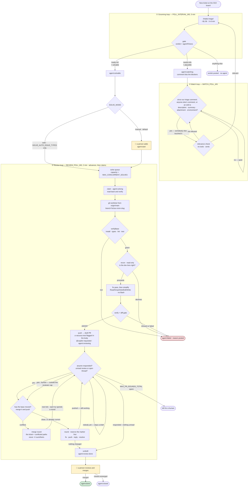
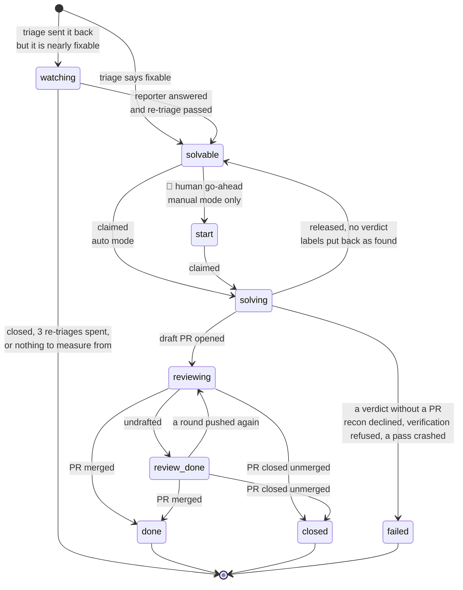

# the-jira-police

A service that watches the SSX Jira board, runs Storebrand's `/intake-triage` skill against every
new ticket in its component and status scope, checks the verdict mechanically, and posts it back.

A **second queue** runs alongside it: tickets a triage assessment marked `agent:solvable`, waiting
to be fixed by an agent. That queue claims a ticket, fixes it in an isolated worktree under
mechanical verification, opens a draft pull request and works the review to a handover.

A **third loop** watches tickets triage sent back as nearly-solvable, and re-triages one when the
reporter answers — so a ticket that was one missing acceptance criterion away from being fixable
does not sit there unread.

With `SLACK_MODE` set, every ticket the three touch also gets **one Slack thread** the bot keeps
editing as the work moves — off by default, and described under [Commands](#commands).

**The daemon now claims and solves on its own**, as of 2026-09-06, with `SOLVE_ENABLED=true`. In
the default `manual` mode it still waits for a person to add `agent:start` to each ticket, which
is the one human step in the chain. **A human always merges** — there is no merge call anywhere in
this codebase.

> This paragraph said _"a person still starts every solve"_ and _"what the daemon does on its own
> is advance pull requests that already exist"_ until 2026-09-06, when both stopped being true.
> Recorded rather than quietly corrected: prose drifting away from behaviour is the defect class
> this service exists to catch, and the README is not exempt from it.

`ARCHITECTURE.md` is the design document's quickindex — why grooming is three steps, which
credential is allowed to do what, and what is deliberately unbuilt, routed to the right
`architecture/*.md` file. This file is how to run it.

---

## The whole flow

Three loops, one board. Everything the watch and solve loops know is written where a person can
read it — labels on the ticket, a marker comment on the pull request — so their state survives a
restart, a wiped `state/`, and a second instance. Grooming alone keeps its cursor on disk, in
`state/poll.json` ([below](#the-two-things-that-catch-people-out)).


```mermaid
flowchart TD
    NEW([New ticket on the SSX board])

    subgraph GROOM["① Grooming loop — POLL_INTERVAL_MS, 5 min"]
        TRIAGE["/intake-triage/<br/>~$1.56 · 3–8 min"]
        GATE{"gate<br/>verdict + agentFitness"}
    end

    NEW --> TRIAGE
    TRIAGE --> GATE

    GATE -->|"ready-ish<br/>+ solvable"| SOLVABLE["agent:solvable"]
    GATE -->|"needs-info<br/>+ plausible"| WATCHING["agent:watching<br/>comment lists the blockers"]
    GATE -->|"anything else"| PARKED([verdict posted · no agent])

    subgraph WATCH["② Watch loop — WATCH_POLL_MS"]
        RELEVANT{"since our triage comment:<br/>anyone else's comment, or an edit to<br/>description · summary · attachment · environment?"}
        CHECKREL{"relevance check<br/>no tools · cents"}
    end

    WATCHING --> RELEVANT
    RELEVANT -->|"no — quiet"| RELEVANT
    RELEVANT -->|"yes — somebody else touched it"| CHECKREL
    CHECKREL -->|"not relevant"| RELEVANT
    CHECKREL -->|relevant| TRIAGE

    SOLVABLE --> MODE{SOLVE_MODE}
    MODE -->|manual · default| HUMAN["👤 a person adds<br/>agent:start"]
    MODE -->|"auto · SOLVE_AUTO_ISSUE_TYPES only"| QUEUE
    HUMAN --> QUEUE

    subgraph SOLVE["③ Review loop — REVIEW_POLL_MS, 2 min · advances, then claims"]
        QUEUE["solve queue<br/>capacity = MAX_CONCURRENT_SOLVES"]
        CLAIM["claim · agent:solving<br/>read back and verify"]
        WT["git worktree from origin/main<br/>branch fix/ssx-nnnn-slug"]
        BASE{"verifyBase<br/>install · types · lint · test"}
        RECON{"recon · read-only<br/>is the dev lens right?"}
        WRITE["fix pass, then simplify<br/>Read/Grep/Glob/Edit/Write · no Bash"]
        CHECK{"verify + diff gate"}
        PUBLISH["push → draft PR<br/>a vacuous test flagged in the body<br/>@copilot requested · agent:reviewing"]
        INBOX{"anyone responded?<br/>unread review or open thread?"}
        SYNC{"has the base moved?<br/>merge it and push"}
        MERGEPASS["merge round<br/>the ticket + conflicted paths<br/>never -X ours/theirs"]
        ROUND["round · reserve the marker first<br/>fix · push · reply · resolve"]
        UNDRAFT["undraft<br/>agent:review-done"]
    end

    QUEUE --> CLAIM
    CLAIM --> WT
    WT --> BASE
    BASE -->|red| FAILED([agent:failed · reason posted])
    BASE -->|green| RECON
    RECON -->|declines| FAILED
    RECON -->|proceeds| WRITE
    WRITE --> CHECK
    CHECK -->|"refused or failed"| FAILED
    CHECK -->|passed| PUBLISH
    PUBLISH --> INBOX
    INBOX -->|"nobody yet — stays a draft"| INBOX
    INBOX -->|"MAX_PR_ROUNDS_TOTAL spent"| STUCK([left for a human])
    INBOX -->|"yes · reviewer"| SYNC
    INBOX -->|"yes · human — outside the reviewer cap"| SYNC
    SYNC -->|"clean, or already current"| ROUND
    SYNC -->|conflicts| MERGEPASS
    MERGEPASS -->|"next tick · each try spends a round"| INBOX
    ROUND -->|"pushed — still working"| INBOX
    ROUND -->|"nothing changed"| UNDRAFT
    INBOX -->|"responded · nothing unread"| UNDRAFT
    UNDRAFT --> MERGE["👤 a person reviews and merges"]
    MERGE -->|merged| AGENTDONE([agent:done])
    MERGE -->|closed unmerged| AGENTCLOSED([agent:closed])

    style HUMAN fill:#fff3cd,stroke:#856404
    style MERGE fill:#fff3cd,stroke:#856404
    style AGENTDONE fill:#d4edda,stroke:#155724
    style FAILED fill:#f8d7da,stroke:#721c24
```

**The two yellow boxes are the only places a person is required.** Everything else runs unattended.

### One session per pass

The boxes labelled recon, fix, simplify, round and merge are separate `storecode` invocations of the
`agent-solve` skill, not turns of one conversation. These are the rungs you can type; `PASSES` in
`runner.ts` is the list, and it holds one more — `repair`, which has no rung of its own because
nothing types it: a failed verification runs it, and `REPAIR_ROUND=false` turns it off. What may be
typed is `--repair`, which decides what a green round may do rather than whether one runs. The
count is deliberately not written here: `architecture/solve.md` §15 owns it, along with why a
repair is acted on at all, and the last time the count lived in two files it was wrong in both.

| Pass         | Tools                                | Given, besides the ticket                    |
| ------------ | ------------------------------------ | -------------------------------------------- |
| `--recon`    | `Read` `Grep` `Glob` — **read-only** | nothing else                                 |
| `--fix`      | …plus `Write` `Edit`                 | the recon verdict                            |
| `--simplify` | same as `fix`, plus `Skill`          | the diff, and **not** the recon verdict      |
| `--review`   | same as `fix`                        | the reviewer's comments                      |
| `--merge`    | same as `fix`                        | the conflicted paths, and **not** the review |

**Every pass is shown the ticket, and none of them has `Bash`**, so there is no git, no test runner
and no package manager inside any model session. The harness runs every command itself and reads
exit codes; the model is never asked whether the tests passed.

Separate sessions rather than one conversation is the safety property: a pass cannot carry a capability
past the point it was granted for, and a pass that dies cannot leave a later one reasoning from
half a conversation. Recon runs first and its verdict is honoured — if it says stop, the fix pass
never starts and **no model gets write access for that ticket at all**. The same happens when it
says proceed with a plan naming a file the diff gate refuses by name, such as a lockfile: the harness stops
the run there and says so on the ticket. `--simplify` is given the
diff and not the recon verdict deliberately: handing it the plan would invite it to reconsider the
change instead of the way the change is written.

### The labels are the state machine

No solve state lives on disk. The ticket carries it:


```mermaid
stateDiagram-v2
    [*] --> solvable: triage says fixable
    [*] --> watching: triage sent it back<br/>but it is nearly fixable
    watching --> solvable: reporter answered<br/>and re-triage passed
    watching --> [*]: closed, 3 re-triages spent,<br/>or nothing to measure from
    solvable --> start: 👤 human go-ahead<br/>manual mode only
    solvable --> solving: claimed<br/>auto mode
    start --> solving: claimed
    solving --> reviewing: draft PR opened
    solving --> failed: a verdict without a PR<br/>recon declined, verification refused, a pass crashed
    solving --> solvable: released, no verdict<br/>labels put back as found
    reviewing --> review_done: undrafted
    review_done --> reviewing: a round pushed again
    reviewing --> done: PR merged
    reviewing --> closed: PR closed unmerged
    review_done --> done: PR merged
    review_done --> closed: PR closed unmerged
    done --> [*]
    closed --> [*]
    failed --> [*]
```

`agent:solving` is written **before** any work starts — that single edit is the claim, and it is
what makes the queue idempotent across restarts. A second instance can still race it between the
claim's re-read and its write, since there is no compare-and-swap. `agent:reviewing` _replaces_ it, so
a pull request waiting on a human reviewer does not hold the only concurrency slot for days.
`agent:done` means **merged**, and is therefore the honest count of bugs this tool has fixed.

### What a full run looks like

SSX-3834, 2026-09-06 — the first ticket to travel the entire chain, with a person typing two
things: one reply, and one label.

| time  | event                                                             |
| ----- | ----------------------------------------------------------------- |
| 12:52 | ticket created                                                    |
| 12:55 | grooming tick picks it up · triage runs                           |
| 12:59 | **sent back** · `dor:gaps` · `agent:watching` · 3 blockers listed |
| 13:05 | 👤 reporter answers in a comment                                  |
| 13:11 | watch tick sees a non-bot comment · re-triages · `agent:solvable` |
| 13:15 | 👤 `agent:start` added                                            |
| 13:16 | claimed · worktree cut                                            |
| 13:21 | draft [PR #2662] opened · `agent:reviewing`                       |
| 13:24 | Copilot: 2 inline comments — a real `NaN` regression              |
| 13:28 | round 1 · fixed, replied, both threads resolved                   |
| 13:30 | Copilot approves                                                  |
| 13:31 | round 2 · no change · **undrafted** · `agent:review-done`         |

Claim to draft pull request: **5 minutes 36 seconds.**

[PR #2662]: https://github.com/storebrand-digital/buy-insurance-advisor-web/pull/2662

---

## Setup

Node ≥ 24 and pnpm ≥ 11. There is **no build step** — Node runs the TypeScript directly by
stripping types.

```bash
pnpm install
cp .env.example .env    # then fill in JIRA_EMAIL, JIRA_AUTH, VAULT_PATH
```

**Keep the credential out of the file.** Any sensitive setting may be written `keychain:<name>`,
and the service reads the named item from your macOS login keychain once, at startup, inside the
process — never through the file and never through the environment it was launched with, which
anything running as you can read with `ps -E`. Store the item in your own terminal, not through an
agent session, since whatever an agent runs lands in its context:

```bash
security add-generic-password -a "$USER" -s the-jira-police.JIRA_AUTH -T "" -w   # asks for the value
```

and write `JIRA_AUTH=keychain:the-jira-police.JIRA_AUTH` in `.env`. `-T ""` trusts no application,
so every read raises a dialog: one per referenced secret each time the daemon or a command starts,
and it cannot say who asked, so allow it only when you just started something. **Never choose
"Always Allow"** — it makes every later read silent, an agent's included. A denied or unanswered
dialog stops the start, naming the setting: exit 78, except from `attach:stage`, which exits 3 on
any failure. Store the value without a trailing
newline: `security` prints a value holding one as hex, which then arrives as the wrong secret —
`security find-generic-password -a "$USER" -s <name> -w | wc -c` should print the token's length
plus one. Commands that reach nothing
(`repair:ledger`, `sweep:once`) resolve nothing and ask for nothing.

`SLACK_BOT_TOKEN` is the only other sensitive setting and takes the same form, stored as
`the-jira-police.SLACK_BOT_TOKEN`. A reference there is resolved at every start too, whether or not
`SLACK_MODE` is on, so it adds a second dialog to every command that asks for `JIRA_AUTH`.

`JIRA_EMAIL`, `JIRA_AUTH` and `VAULT_PATH` are all grooming needs. **Solving needs three more with
no defaults** — `SOLVE_REPO_ROOT`, `SOLVE_REPOS` and `SOLVE_GITHUB_OWNER` — and each one is unset
rather than guessed because a default there is a privilege that survives being deleted from `.env`.
See Settings.

**`.env.example` is a working configuration, not the defaults.** It switches solving on and names
the real skill, so a `.env` copied from it runs more than grooming. Read what it sets before the
demo path below, which assumes `SOLVE_ENABLED`, `WATCH_ENABLED`, `WRITE_BACK` and `SLACK_MODE` at
their defaults.

Check it without spending anything:

```bash
pnpm poll:once --dry-run
```

That does discovery only — no model call, no cost, no writes. It is the fastest way to find out
whether the credential and the JQL scope are right.

---

## Demo path

Five commands, in escalating order of what they touch. Nothing below writes to Jira unless the
command says so — with `SLACK_MODE` at its default, `off`. Set to `live`, anything that triages also
posts the ticket's Slack thread and saves the `jira-police.slack` property on it, stand-in skills
and previews included; see [Commands](#commands).

### 1. What would be triaged?

```bash
pnpm poll:once --dry-run
```

Lists the new tickets discovery found and stops. Free.

### 2. Triage one ticket, without posting

```bash
pnpm triage:once SSX-1234 --skill intake-triage
```

Runs the real skill — 3–8 minutes, **$1.56 measured** — writes `groomed/SSX-1234.md`, and posts
**nothing**. The report contains the verdict, the label delta, the DoR check, and the
**agent-fitness call** —
whether this ticket looks safely fixable by an agent, with the reasoning.

Add `--write` to actually post the comment and labels:

```bash
pnpm triage:once SSX-1234 --skill intake-triage --write
```

`--write` **decides** `WRITE_BACK` for that run rather than adding to it — typing it posts even
if `.env` says `false`, and omitting it previews even if `.env` says `true`. Both directions are
deliberate: an operator who does not type the flag cannot post to a shared ticket by inheriting a
setting they never looked at. There is no `--no-write`; preview is the default.

One exception: a stand-in skill (`mock-triage`, `live-triage-probe`) never posts, flag or not. A
rehearsal that comments on a real ticket is not a rehearsal.

### 3. What would the solve queue pick up?

```bash
SOLVE_ENABLED=true pnpm solve:once
cat groomed/solve-cycle.md
```

Reads the board, works out which tickets it would claim and the exact label edit each claim would
be, and writes it all to `groomed/solve-cycle.md`. **Changes nothing** — not a label, not a
branch, not a file.

The report carries the config the cycle ran under, both JQL queries verbatim so you can paste
them into Jira and check by hand, and every candidate with the decision made about it beside the
labels that decision was made from.

### 4. Watch a sent-back ticket, without posting

```bash
pnpm watch:once SSX-1234
```

Reads every ticket carrying `agent:watching` — or just the named one — and prints one of three
decisions per ticket: `RETRIAGE` with the comment or field change that triggered it, `DROP` with
the reason the watch is being given up, or `quiet`. Writes nothing. Add `--write` to act on it.

The trigger is deliberately _somebody else changed the ticket_, not _the ticket changed_: posting
a triage comment is itself a change, so the naive version re-triages forever at $1.56 a lap.

### 5. Run the daemon

```bash
pnpm start --skill mock-triage --interval 10s --for 1m
```

**Grooming only, unless you switch the others on.** `SOLVE_ENABLED` and `WATCH_ENABLED` both
default to false — though a `.env` copied from `.env.example` has solving on — and each one off
means that loop is never constructed — not started-and-idle.
With both on, the daemon runs the full chain in the diagram above: it claims, solves, opens pull
requests, works reviews, and re-triages sent-back tickets, with no person between the steps except
`agent:start` and the merge.

The next section is how to work up to that.

---

## Running the daemon for real

`pnpm start` polls, triages and repeats until told to stop, drawing its log in the live viewer as it
goes; `pnpm start:daemon` is the same loop with no viewer, for a redirect or a service manager.
Three flags override settings **for a single run**, so a smoke test needs no edit to `.env` and
leaves nothing behind in it:

| Flag                    | Overrides                      | Example                     |
| ----------------------- | ------------------------------ | --------------------------- |
| `--skill <name>`        | `SKILL_NAME`                   | `--skill live-triage-probe` |
| `--interval <duration>` | `POLL_INTERVAL_MS`             | `--interval 30s`            |
| `--for <duration>`      | nothing — bounds the whole run | `--for 4m`                  |

Durations take `ms`, `s`, `m`, `h`, or a bare millisecond count: `30s`, `4m`, `1.5m`, `2h`.

`--interval` moves the grooming loop only. The review loop reads `REVIEW_POLL_MS` and there is no
flag for it, which is deliberate: that cadence is how long a reviewer's reply waits, and shortening
a smoke test should not shorten the service's patience.

There is **no `--write` flag on the daemon.** Unlike `triage:once`, posting a triage is controlled
only by `WRITE_BACK` in the environment. A long-running unattended process should not be able to
acquire write access from a shell history entry. The other loops are switched, not gated: with
`WATCH_ENABLED` on a re-triage always posts, since one that posted nothing would be bought again
every sweep, and with `SOLVE_ENABLED` on the solve and review loops write labels and pull requests
whatever `WRITE_BACK` says.

### Work up to it in four steps

Each step turns on one more real thing. Run each for a bounded `--for` and read the log before going
on: `pnpm start` shows it live in [the viewer](#reading-the-log). To read the same run twice, capture
it with `pnpm start:daemon … > run.ndjson 2>&1` and replay it with `pnpm logs < run.ndjson`. Every
step assumes `SOLVE_ENABLED`, `WATCH_ENABLED` and `SLACK_MODE` off, as they are by default.

**1 — the loop itself. No Atlassian session, no tools, no real verdict.**

```bash
pnpm start --skill mock-triage --interval 10s --for 1m
```

`mock-triage` reads nothing and is given an empty tool allowlist, so its session answers from the
key alone. This exercises cadence, the cursor, the state file, backoff and graceful shutdown.
Discovery still queries Jira and each ticket is still one model session, so it is cheap rather than
free. If something is wrong with the _service_, it is wrong here.

Expect one `cycle.done` per interval and a clean stop. The viewer renders these a line at a time;
below is the raw form, which is what `pnpm start:daemon` writes to a file:

```
{"message":"service.start", …}
{"message":"cycle.done","found":1,"skipped":1,"triaged":0, …}
{"message":"cycle.done","found":1,"skipped":1,"triaged":0, …}
{"message":"shutdown.requested","reason":"deadline", …}
{"message":"service.stopped","cycles":2,"failures":0, …}
```

`found: 1, triaged: 0` is the normal result on a repeat run — the ticket was found and then
skipped because it is already in `seenKeys`. See _the cursor persists_ below. `LOG_LEVEL=debug`
adds a `poll.query` line per cycle carrying the JQL.

**2 — a real Atlassian session, still no verdicts.**

```bash
pnpm start --skill live-triage-probe --interval 30s --for 4m
```

`live-triage-probe` is a stand-in: it opens a genuine MCP session and reads the ticket, so it
proves the subprocess contract, MCP connectivity and the timeout path. It is **structurally
unable to post** — stand-in skills are pinned to preview no matter what `WRITE_BACK` says.

**3 — the real skill, previewing.**

```bash
FIRST_RUN_LOOKBACK_MINUTES=5 pnpm start --skill intake-triage --for 20m
```

Real triage, real cost — roughly **$1.56 and 3–8 minutes per ticket**. Reports land in
`groomed/`; nothing reaches Jira while `WRITE_BACK=false`, which is the default.

> This figure read `$0.11` here and in three arguments in `PLAN.md` until 2026-09-05, when a run
> was actually metered. It was wrong by **14×**, always in the cheap direction, and every cost
> argument built on it was understated by an order of magnitude. Quote measured numbers, and say
> when they were measured.

Name the skill on the command line even if `.env` already sets it. `SKILL_NAME` **defaults to
`mock-triage`**, deliberately — an unconfigured service must not be able to post — so a run that
omits the flag on a machine without that setting quietly produces mock verdicts, and mock output
is plausible enough to be believed. Stating it makes each step of this ladder self-contained.

Note `--interval` is the gap _between_ cycles, not a rate limit on triages: a cycle takes as long
as its tickets do, so `--interval 20s` with the real skill does not mean three triages a minute.

**4 — writing to the board.**

```bash
WRITE_BACK=true pnpm start --skill intake-triage --for 20m
```

Everything above, plus comments and labels on real tickets, as your own Jira user.

Both halves are required and neither is enough alone: a stand-in skill ignores `WRITE_BACK`
entirely, and the real skill with `WRITE_BACK=false` previews. Posting needs the real skill _and_
the setting.

### The two things that catch people out

**The lookback window on a first run.** With no state file the service looks back
`FIRST_RUN_LOOKBACK_MINUTES` (default 60). Widen it and you get _one paid triage per historical
issue_ in the window. Narrow it for a demo:

```bash
FIRST_RUN_LOOKBACK_MINUTES=5 pnpm start --for 10m
```

**The cursor persists.** `state/poll.json` holds the cursor and the most recent keys seen, capped at `MAX_SEEN_KEYS`:

```json
{ "cursor": "2026-09-03T20:01:26.658+0200", "seenKeys": ["SSX-3813", "SSX-3814", "…"] }
```

A ticket in `seenKeys` is never triaged again, so a second demo run finds nothing. To replay:

```bash
rm state/poll.json          # full reset — re-triages everything in the lookback window
```

Both `state/` and `groomed/` are gitignored. The file is re-read at the start of every cycle
rather than held in memory, so editing it out of band between cycles is respected rather than
clobbered. Within a cycle it is not re-read: a `poll:once` that finishes while one is running can
have its keys overwritten by that cycle's next save.

### Stopping it

`Ctrl-C` (or `SIGTERM`, or closing the terminal) lets the ticket in flight finish and leaves the
rest of the cycle for next time, so a ticket mid-triage is either completed and recorded or left
untouched. A **second** signal
exits immediately. Look for `service.stopped` in the log — its absence means the process died
rather than stopped.

---

## Demoing the solve queue end to end

The queue selects on labels, so a demo needs a ticket wearing them. It is staged on purpose:
three of these four observations should be empty, and that is what makes the fourth mean
something.

Pick a ticket in `SSX` / component `SSX Advisor`, not Done, carrying a `svc:<repo>` label naming
a repo on `SOLVE_REPOS`.

| Step | Do                                  | Expect in `groomed/solve-cycle.md`                                  |
| ---- | ----------------------------------- | ------------------------------------------------------------------- |
| 0    | Nothing — run it as a control       | `## The queue was empty`                                            |
| 1    | Add `agent:solvable` in the Jira UI | Still empty — the human gate is holding                             |
| 2    | Add `agent:start`                   | `## PLAN — SSX-1234` with the claim `+agent:solving` `-agent:start` |
| 3    | Remove both labels                  | Empty again                                                         |

Re-run `SOLVE_ENABLED=true pnpm solve:once` after each step.

**Add the labels however you like.** This paragraph used to say "in the Jira UI, not through the
MCP tool", because the only write path this service had replaced the whole label field and would
silently drop anything edited in between. The claim and release no longer do: they go through
`JiraClient.updateLabels`, which sends Jira's own `update.labels.add` / `.remove` and can only ever
name `agent:*`. See invariant 11 in [`architecture/invariants.md`](architecture/invariants.md).

The other two decision types need no board changes — both are env overrides on top of step 2:

```bash
# SKIP — eligible, but the repository is not allowed
SOLVE_ENABLED=true SOLVE_REPOS= pnpm solve:once

# WAIT — eligible and allowed, but no capacity this cycle
SOLVE_ENABLED=true MAX_CONCURRENT_SOLVES=0 pnpm solve:once
```

`groomed/solve-cycle.md` is a snapshot, replaced on every run. To keep a stage for comparison,
`cp` it somewhere between runs.

---

## Commands

| Command                                                | What it does                                                                                                                    | Writes?                                              |
| ------------------------------------------------------ | ------------------------------------------------------------------------------------------------------------------------------- | ---------------------------------------------------- |
| `pnpm poll:once --dry-run`                             | Discovery only. Free                                                                                                            | no                                                   |
| `pnpm poll:once`                                       | One full grooming cycle                                                                                                         | `state/`, `groomed/`; Jira with `WRITE_BACK=true`    |
| `pnpm triage:once <KEY> --skill intake-triage`         | Triage one ticket, preview the result                                                                                           | `groomed/<KEY>.md`                                   |
| `pnpm triage:once <KEY> --skill intake-triage --write` | …and post it. The flag decides `WRITE_BACK` on its own                                                                          | Jira                                                 |
| `pnpm triage:once <KEY>`                               | Same, but the skill comes from `SKILL_NAME` — **which defaults to the mock**                                                    | `groomed/<KEY>.md`                                   |
| `pnpm solve:once`                                      | One solve cycle. Needs `SOLVE_ENABLED=true`                                                                                     | `groomed/solve-cycle.md`                             |
| `pnpm bot:once <KEY> --review`                         | The whole chain on one ticket: triage, claim, solve, PR, rounds                                                                 | Jira **and** GitHub                                  |
| `pnpm recon:once <KEY>`                                | Recon alone against one real ticket: proceed or bail, no fix, no diff, no PR                                                    | a report + a worktree, removed                       |
| `pnpm watch:once`                                      | What the sendback watch would do to every `agent:watching` ticket                                                               | no                                                   |
| `pnpm watch:once <KEY> --write`                        | …and do it: re-triage, or drop the watch                                                                                        | Jira                                                 |
| `pnpm start`                                           | The daemon **and** the live log viewer, together. Takes `--skill`, `--interval`, `--for`                                        | per switch; triage with `WRITE_BACK=true`            |
| `pnpm start:daemon`                                    | The same daemon, headless — what a redirect, cron or CI wants. Same flags                                                       | as above                                             |
| `pnpm dev`                                             | The **headless** daemon with `--watch`; same flags. A restart would tear the viewer down anyway                                 | as above                                             |
| `pnpm attach:stage <KEY> [--keep]`                     | Stage that ticket's images and print the block a pass would be given. `--keep` leaves the files behind                          | a report + `tmpdir()`                                |
| `pnpm daemon:status`                                   | Is a daemon running from any checkout of this repo? Reads `ps`; no credential, no network                                       | no                                                   |
| `pnpm repair:ledger`                                   | Every repair round so far, as a distribution, and which green ones nobody has read. No credential                               | no                                                   |
| `pnpm sweep:once`                                      | Report stale skill roots and staged-image directories past `STAGING_SWEEP_MAX_AGE_MS`                                           | a report                                             |
| `pnpm sweep:once --write`                              | …and remove them. Never a live git worktree — see below                                                                         | filesystem: the worktree and staging roots           |
| `pnpm slack:probe <KEY> [--keep]`                      | Post, edit and delete one message in `SLACK_CHANNEL_ID`; write, read back and delete a record on the ticket. A verdict per step | Slack and one Jira property, both removed + a report |
| `pnpm slack:once <KEY>`                                | Draw the ticket's audit thread from its record, dry: the record and the exact Slack request                                     | `groomed/slack/`                                     |
| `pnpm slack:once <KEY> --post`                         | …and post or edit the thread for real, saving the record on the ticket                                                          | Slack + the `jira-police.slack` property             |
| `pnpm slack:once <KEY> --post --bump`                  | …and broadcast its latest major entry to the channel again, deleting the ticket's previous broadcast                            | Slack + the `jira-police.slack` property             |
| `pnpm slack:listen`                                    | Answer `/bencebot` until Ctrl-C, dry: the real subscriber list read, what each command would make of it written                 | `groomed/slack/roster.json`                          |
| `pnpm slack:listen --write`                            | …and write the list, reading it back after each change                                                                          | the `jira-police.slack-subscribers` project property |
| `pnpm logs`                                            | The log reader. Filters a piped or replayed stream by mark, level and source. Reads stdin, never Jira                           | no                                                   |
| `pnpm docs:check`                                      | Prose checked against the tree: cited numbers, links, pinned copies, reading length. ~3s                                        | no                                                   |
| `pnpm test:hooks`                                      | The `.claude/hooks/` guards, which vitest does not cover                                                                        | no                                                   |
| `pnpm hooks:brief`                                     | Print what a session gets injected after a compaction, without waiting for one                                                  | no                                                   |
| `pnpm hooks:commit-brief`                              | Print what a session gets told when it is about to commit, without committing                                                   | no                                                   |
| `pnpm check-types && pnpm lint && pnpm test`           | The code check. CI also runs `format:check`, `test:hooks` and `docs:check`                                                      | no                                                   |

**The Writes? column is for `SLACK_MODE=off`, the default.** With `dry`, every row that triages or
runs a model pass also writes `<OUTPUT_DIR>/slack/`; with `live`, it posts that ticket's Slack thread
and saves its `jira-police.slack` property — `recon:once` and a previewing `triage:once` included.

**`attach:stage` stages a ticket's images for a person to judge, and posts nothing.** Triage reads
staged images only with `TRIAGE_IMAGES` on, and recon only with `RECON_IMAGES` on — both off by
default — and no pass after recon ever sees one. The command downloads, writes the staged files to
a read-only directory under `tmpdir()` and the report to `<OUTPUT_DIR>/<KEY>.attachments.md`. Exit
1 means the ticket has images and none of them is staged, which is the case a pass has to bail on.
[`architecture/not-built.md` §13](architecture/not-built.md) has the decision behind it.

**`recon:once` is the only way to run recon outside the full solve pipeline.** It cuts a real
worktree from `SOLVE_REPO_ROOT`, runs recon in it, and discards the worktree afterwards whether
recon proceeds or bails — there is nothing in there to lose, since recon holds no `Write` and no
`Edit`. Only a crashed recon keeps it, for a person to see what recon saw. `--claim`, `--pr` and
every other write rung `solve:once` has are absent on purpose: this command's whole job is to be
safe to run against a ticket nobody has decided is solvable yet. Its report lands at
`<OUTPUT_DIR>/<KEY>.recon.md`.

**`sweep:once` never removes a live git worktree, whatever its age.** A worktree sits at the bare
path `<root>/<KEY>`, while every directory this command may remove carries a `-skill-` or `-img-`
segment that `ISSUE_KEY` (`src/solve/worktree.ts`) cannot produce — so the classifier in
`src/staging-sweep.ts` never matches one, and a name it does not recognise is left alone and left
unreported rather than swept. Dry by default, same shape as `triage:once`; nothing in `index.ts` or
`review-loop.ts` calls it, so a stale directory only goes away when someone runs it.

**`pnpm repair:ledger` is the only place every repair round's verdict survives the run that bought
it.** A failed verification — a solve's or a review round's — buys one repair pass, and what it
concludes is discarded unless the run was armed — `--repair` typed, or `REPAIR_PUBLISH` for the daemon —
(`architecture/solve.md` §15), so every round that reaches a verdict, promoted
or not, appends a row to `<OUTPUT_DIR>/repair-rounds.md` and this command reads that page back:
how the rounds ended, and which green ones nobody has looked at.
**The `Read` column is not the harness's to fill.** A green round is written `unread` and stays
that way until a person reads the round's edits — `git diff HEAD` in the worktree the row names,
where the fix is committed underneath them — and edits the cell by hand. Correcting the code and
weakening the assertion that failed both come back green, and
nothing mechanical here separates them. So an untouched page means rounds happened, not that any of
them were honest. Needs no credential, which is deliberate: a command that reaches nothing should
require nothing, so this one runs in a fresh clone and in a checkout nobody has configured.

**`OUTPUT_DIR` is relative, so it reads the page belonging to the directory you run it in**, and a
solve writes its row under the checkout it ran in. Those are the same directory in the primary
checkout and need not be in a worktree, so the command prints the absolute path it read and, when
there is no page, says outright that an absent file is not evidence that no round has run.

**With `SLACK_MODE` set, every ticket the pipeline touches gets one Slack thread, and the bot keeps
editing its first message,** drawn collapsed to the ticket's title, with the card inside. An edit
never moves a message, so each line below that decides the ticket's fate is also posted as a
one-line reply sent to the channel, and the ticket's previous one is deleted: the ticket resurfaces
at the bottom once, as its latest event, mentioning everyone on the subscriber list below. Triage starting opens it; the verdict, a gate refusal, a claim, each
model pass, the solve's outcome, the pull request, each review round, the undraft, the merge and
any crash land on it — the ones that decide the ticket's fate as their own lines, the rest in the
timeline, newest first. The undraft is one line per handover, however many looks find the pull
request ready; a round that pushes a change, or a person drafting it, makes the next one news. A
ticket already in review when the thread starts gets it from the review loop's first look, which
fills in the title, the pull request, and triage as the ticket's labels state it. A thread started
without a title, as a key typed at `triage:once` starts one, reads it from Jira once; if that read
fails the card keeps the key and `slack.title_lookup_failed` says why. Every other reply is left to people. `dry` writes what each thread would be to
`<OUTPUT_DIR>/slack/<KEY>.message.json` and the record beside it, changing nothing remote; `live`
posts it and saves the record on the ticket. Either way a Slack or Jira failure is logged as
`slack.audit_failed` — or `slack.record_unreadable`, for a record this version cannot read — with
the remote system's own reason, and never fails the work it was reporting. What does stop work is
a `live` mode that cannot be built, from a missing setting or a token that is not a bot token: it
stops the start, before any claim. Try `dry` on a command you were going to run anyway before
setting `live`.

**`slack:once <KEY>` draws one ticket's thread by hand.** It reads the ticket and its
`jira-police.slack` record — a record that does not exist yet is started fresh — and draws the
message. Dry by default, writing the same two files; `--post` posts the thread, or edits it if the
ticket already has one, and saves the record on the ticket. `--bump` resurfaces the ticket by hand:
its latest major entry is broadcast again and its previous broadcast deleted, which is also the only
way to drive a broadcast on a ticket you choose. A record this version cannot read is left as found
and the command exits 1 saying so: deleting the property starts the thread afresh.

**`slack:listen` answers `/bencebot`, and the subscriber list is what it changes.**
`/bencebot subscribe` puts you on one list, for every ticket, and each broadcast then mentions you;
`/bencebot unsubscribe` takes you off, and a bare `/bencebot` says which you are. The reply is only
visible to you. Who is added is the Slack user who typed it, never a name in the text. The list is
the `jira-police.slack-subscribers` property on `JIRA_PROJECT`, read at each broadcast, so a change
applies from the next one; a list this version cannot read is left as found, each command says so,
and broadcasts go out without mentions and log `slack.subscribers_unread`. The command holds a
Socket Mode connection, because the daemon has no public URL, and reconnects whenever Slack drops
it. Dry, it reads the real list and writes what each command would make of it to
`<OUTPUT_DIR>/slack/roster.json`, and every reply starts `(dry run, nothing written)`. `--write`
writes the property and reads it back, and a reply that cannot see its own change says so. The
credential needs Administer Projects on `JIRA_PROJECT` for that write, and nothing else here does.
The daemon answers it too once `SLACK_LISTEN` is `dry` or `live`, the same two modes; off by
default, and a missing or wrong `SLACK_APP_TOKEN` stops the start. A hand-run listener beside the
daemon is harmless but halves what each sees, since Slack gives each command to one connection.
On a network that drops, Slack can report a command as failed that went through: `/bencebot` says
where you stand, and `slack.command_late` in the log says the reply missed Slack's budget.

**`slack:probe <KEY>` measures what that rests on.**
The audit thread is a Slack message the bot keeps editing, with its state — which message, and
the record it shows — kept on the ticket as the `jira-police.slack` issue property. So before
anything relies on either, this command checks both against the real systems: one message posted,
edited and deleted in `SLACK_CHANNEL_ID`, and a record the size of a full one written to the named
ticket as `jira-police.slack-probe`, read back, and deleted. Every step prints `PASS` or `FAIL` with
the remote system's own error, and the table lands in `<OUTPUT_DIR>/slack-probe.md`. Exit 0 means
both halves hold and 1 that a step failed; 78 means a setting is missing, the token is not a bot
token, or a keychain dialog was denied. The state was first meant to live in the message's own Slack metadata, and this
command's first run is why it does not: Slack drops a custom metadata type unless the manifest
declares it, and a declared one cannot hold a list of timeline entries.

To set it up, create the app from the manifest rather than by hand:

1. [api.slack.com/apps](https://api.slack.com/apps) → **Create New App** → **From an app manifest**,
   then paste `docs/slack-app-manifest.json`. It asks for `chat:write` and `commands`, declares
   `/bencebot`, turns Socket Mode on and both token rotations off, since nothing here refreshes a
   token. An app made from an earlier copy takes the new one under **App Manifest**, then a
   reinstall.
2. **Install to Workspace**, then copy **OAuth & Permissions → Bot User OAuth Token** (`xoxb-…`)
   into `SLACK_BOT_TOKEN`. The **App Configuration Token** on the apps page is a different thing: it
   starts `xoxe.xoxp-`, expires in twelve hours, drives only the manifest API, and cannot post.
3. In a public channel, `/invite @Bencebot`, and copy the channel ID from the bottom of its details
   pane into `SLACK_CHANNEL_ID`.
4. For `/bencebot` only: **Basic Information → App-Level Tokens → Generate Token and Scopes**, with
   the `connections:write` scope, into `SLACK_APP_TOKEN` (`xapp-…`), best as `keychain:<name>`.

**`pnpm dev`'s `--watch` is Node's file watcher and has nothing to do with `watch:once` or
`WATCH_ENABLED`**, which are the sendback watch, or with `solve:once --watch`, which polls pull
requests under review. Three unrelated meanings of one word, and the collision is in Node's flag
rather than anywhere it can be renamed.

**Let a shutdown finish, and do not press Ctrl-C twice.** The first signal lets the ticket in
flight finish, which on a solve can be several model passes; Node prints `Waiting for graceful
termination...` and will wait indefinitely, because its watcher never escalates to `SIGKILL`. The
second signal exits immediately and skips the `finally` that releases `agent:solving`, and nothing
reclaims that label on its own — with `MAX_CONCURRENT_SOLVES=1` the solve half then does nothing
until you remove it by hand. Same applies to editing a file under `pnpm dev`, which is a restart:
`pnpm daemon:status` says whether one is running.

Pressing `q` under `pnpm start` is a graceful stop, not a detach: the viewer leaves, and the shell
then waits on the daemon while it finishes the ticket in flight. An unresponsive prompt straight after
`q` is that wait, so give it the same patience as Ctrl-C.

The typecheck script is **`check-types`**, not `typecheck`.

### Reading the log

Nearly every line the service writes is a JSON object, which is exact and unreadable at the rate a
cycle produces it; the solve rungs also print plain progress lines. `pnpm logs` is the reader. Pipe a run into it, or replay a file:

```bash
pnpm poll:once --dry-run 2>&1 | tee run.ndjson   # capture something first, free
pnpm logs < run.ndjson                           # then read it, as many times as you like
```

**Redirect stderr, or you will never see a warning.** `warn` and `error` go to stderr and everything
else to stdout, so a bare `|` hands the viewer everything except the two levels you were probably
looking for, and silently drops 🟠 and 🔴. Nothing in the viewer can detect this — the missing lines
were never written to the pipe.

**To watch a live daemon there is nothing to assemble: `pnpm start` is that pipeline.** It runs the
daemon into the viewer. The headless daemon — for files, cron and CI — is `pnpm start:daemon`:

```bash
pnpm start --interval 30s --for 10m                            # daemon plus viewer, one command
pnpm start:daemon --interval 30s --for 10m > run.ndjson 2>&1   # headless, writes a file
```

Two things that pipeline gets right that a hand-written one usually does not. `2>&1`, for the reason
above. And **the daemon's stdin is redirected away from the terminal**: Node restores the saved
termios when a process holding a tty on fd 0 exits, so the daemon exiting silently puts the terminal
back into cooked mode and the viewer stops receiving keystrokes. Measured under a pty — `q` was
echoed to the screen instead of quitting, and nothing on either side reported a problem.

Quitting the viewer closes the daemon's stdout, and the daemon treats that as a shutdown request:
it unwinds the current cycle, so the `finally` releasing `agent:solving` runs. Left unhandled that
write is an `EPIPE` raised as an unhandled `error` event, which exits 1 and strands the claim — the
same stranded label as pressing Ctrl-C twice, reached by pressing `q` in what looks like a read-only
window. `src/broken-pipe.ts` is the handler, and the `finally`-was-skipped half was measured before
it was written.

It reads lines from **stdin** and keys from `/dev/tty`, so the pipe and the keyboard are two
different descriptors and both work at once. It posts nothing, reads no settings and holds no
credential — the safe thing to try it on is a `--dry-run` you have already captured.

**It exits 2 rather than drawing, in both directions.** With no controlling terminal — cron, CI, a
detached process — there is nothing to draw on, which is also why `pnpm start` fails there and
`pnpm start:daemon` is what those places want. With nothing piped in, there is nothing to draw:
stdin would be the terminal, so no line could ever arrive, and the line reader and the key reader
would be racing for the same bytes with `q` as likely to be eaten as anything else. Both cases say
what to run instead.

Three rows of switches, all ANDed. Everything shows until you press something; **each key hides
its value, and pressing it again brings the value back**. Hiding the last value left on a row
resets that row to everything, so a filter can never blank the screen:

| Keys     | Hides or shows                                                          |
| -------- | ----------------------------------------------------------------------- |
| `1`–`4`  | A level: 🔍 debug, 🔵 info, 🟠 warn, 🔴 error                           |
| `5` `6`  | A `q` mark: ⏳ nothing happened, 🔧 something did                       |
| a letter | A source — `poll`, `solve`, `jira`, … The key is shown beside each name |

**To see one value alone, hide the others** — only warnings and errors is `1` then `2`.

**`1` appears to do nothing unless you asked for debug.** `LOG_LEVEL` defaults to `info`
([`architecture/configuration.md`](architecture/configuration.md)), so 🔍 lines are never written
and hiding them changes nothing on screen — which looks exactly like a broken filter.
`LOG_LEVEL=debug pnpm start …` is the run that writes them.

`f` holds the view where it is, and a second `f` returns to the tail — the one key you want when
something interesting scrolls past mid-cycle. `j`/`k` and the arrows scroll, `g`/`G` jump to either
end, `c` shows everything again, and `q` or escape quits. A value that is showing is drawn in
brackets and one that is hidden in spaces, so the state survives a terminal with no colour; the two
forms are the same width, so nothing on the row moves when you toggle one.

**What would falsify it:** the header counts shown against arrived (`12/480 lines`). If hiding a
source drops the total rather than the shown count, the filter is eating lines instead of hiding
them. A line the parser cannot read — a solve rung's plain progress, `watch:once`'s `↳` report
lines, or a stack trace — is shown verbatim and passes every filter; if one of those disappears when you press
a key, that is the bug worth reporting. Quitting with `q` must give the cursor back: if the shell
afterwards has no cursor or no echo, the restore path did not run, and `reset` fixes the terminal.

**What it has never done:** attach to a daemon that is already running. There is no socket and the
daemon listens on nothing — `pnpm logs` sees only what is piped into it, so a daemon started without
the pipe cannot be watched after the fact. `feed.ts` is an interface with a `send` slot for that
later, and nothing implements it.

### The escalation ladder

Each `solve:once` flag is one phase's worth of privilege, so the command line reads as the
escalation it is. **The ladder is cumulative**: `--pr` claims the ticket, solves it and opens the
pull request. This README previously said it was not, which was true while the phases were built
out of order and `--claim` refused; both are wired now.

```
pnpm solve:once                    # whole queue, dry
pnpm solve:once SSX-1234           # one named ticket, dry
pnpm solve:once SSX-1234 --claim   # claims, checks the queue drops it, releases
pnpm solve:once SSX-1234 --solve   # ... and runs the solver; nothing is pushed
pnpm solve:once SSX-1234 --pr      # ... and opens the draft PR, reviewer @copilot
pnpm solve:once SSX-1234 --review  # ... and works the review through to a handover
pnpm solve:once SSX-1234 --pr --repair  # --pr, and a repair round that goes green opens it
pnpm solve:once SSX-1234 --advance # one review round on a PR an earlier run opened
pnpm solve:once SSX-1234 --advance --repair  # ... and a repair of a failed round that goes green is pushed
pnpm solve:once --watch            # poll every ticket under review until none is left
pnpm solve:once SSX-1234 --watch   # the same loop, narrowed to one ticket

pnpm bot:once SSX-1234 --review    # the same ladder, but triage runs first and gates it
```

**`--repair` is not a rung, it is a modifier on `--pr`, `--review`, `--advance` and `--watch`.** A
failed verification buys a repair round whenever `REPAIR_ROUND` allows, flag or no flag; `--repair`
decides what a green one may do. Without it the verdict is recorded and discarded. With it, the pull
request is opened from the repaired tree as two commits — the fix, then the repair — and its body
says above everything else that the second was written by a pass shown the failure, and should be
read on its own. A review round that fails gets the same: armed, its repair is pushed as the round's
second commit and a `bot:` comment on the pull request names the failure and says to read that
commit on its own. It is refused below `--pr`, with `REPAIR_ROUND=false` (no round would run for it
to act on), and by `bot:once`. **The daemon's copy is `REPAIR_PUBLISH`**, off unless it reads `true` (any case),
and the daemon's startup line says `promotesRepairs` either way; leave it off until you have read
what `--repair` produces by hand. `architecture/solve.md` §15 has why both exist before the
evidence that was meant to justify them.

**`bot:once` is `solve:once` with triage in front.** It takes the same rungs. The difference is
that it triages the ticket first and refuses to claim one the fitness call declines — so it is the
command that proves the whole chain, and the one to run for a demo:

```bash
caffeinate -i pnpm bot:once SSX-1234 --review
```

`caffeinate` is belt-and-braces rather than the fix it used to be. A laptop that slept mid-pass
once spent `SOLVE_TIMEOUT_MS` without the pass running — it killed a recon on SSX-3831 that had
done nothing wrong, and a killed pass is deliberately not retried. **Both budgets now exclude
sleep**: `SESSION_IDLE_TIMEOUT_MS` is a silence budget whose watchdog detects a suspend by timer
drift and credits the gap back, and `SOLVE_TIMEOUT_MS` counts only time the machine was awake.
What `caffeinate` still buys is that a sleeping machine makes no progress at all, which on a run
this long is worth a flag.

**`--advance` and `--watch` are modes, not rungs, and the parser refuses to combine them with
one.** They act on pull requests that finished runs created, so implying `--solve` would mean
re-solving the ticket before touching the review. `--watch` is the only one that runs with no
ticket key at all: bare, its subject is every ticket the review query returns.

**A run that stops short of a pull request either puts the labels back or says why it will not.**
One that reached a verdict about the ticket — recon declined, verification refused, a pass crashed
— writes `agent:failed`, which keeps it out of the queue until a human removes the label, since
re-running it would reach the same verdict. Only a run with no verdict is released: `verified`
below `--pr` or with a publish that failed, and `escaped`. `releaseClaim` undoes the claim's own
edit against the ticket's live labels, derived from the receipt — so a `next:to-trio` a PM added
while the ticket was claimed survives. A run that opened a pull request keeps the ticket, as
`agent:reviewing`, because there the work is real and ongoing.

With `SLACK_MODE` set, every rung from `--solve` up records on the ticket's Slack thread — the
claim, each pass, the outcome, the pull request, each round — and `--claim` alone records nothing.

**The rest of the label state machine is built, and this paragraph used to say it was not.** A
published pull request now moves the ticket from `agent:solving` to `agent:reviewing`; undrafting
writes `agent:review-done` and a round that pushes writes it back, because the arrow runs both
ways; and a pull request that ends gets `agent:done` if it merged and `agent:closed` if it did not.
`agent:done` is therefore the merged-only metric — how many bugs this tool actually fixed — rather
than a note that the agent stopped.

### Temporary: the pnpm 9 shim, and when a solve needs it

**Delete this section once the pilot repository pins its own `packageManager`.** There is a PR to
write that does exactly that; until it merges, this is the workaround.

`--solve` runs the pilot repository's own install and test scripts in the worktree. That
repository's manifest declares no `packageManager`, so `verify.ts` falls back to whichever `pnpm`
is on `PATH` — and this machine's is 11, which no longer honours the `pnpm.overrides` block the
repository's pnpm-9 lockfile depends on. The install dies on a repository whose CI is green. The
refusal says so (`versionNote`), which is how it was diagnosed, but saying so does not fix it.

The shim lives at `~/.pnpm9bin/pnpm` and is **selective rather than blanket**, which is what makes
it safe to leave on `PATH` for a whole session. It walks up from the working directory to the
nearest `package.json`: one that pins a `packageManager` gets the real pnpm, which self-delegates
correctly, and one that does not is assumed to be the pilot repository and gets pnpm 9. So this
repository — which pins `pnpm@11.20.0` and requires `>= 11` — keeps running under 11 even inside a
shimmed shell.

```bash
PATH="$HOME/.pnpm9bin:$PATH" pnpm solve:once SSX-1234 --solve
```

**An earlier version of this section put a blanket shim in `/tmp` and insisted on `node` rather
than `pnpm solve:once`,** because the shell resolves `pnpm` _after_ applying the `PATH=` prefix and
a blanket shim would therefore have run pnpm 9 against this repository, which fails before it
starts. That warning was true of that shim and is not true of this one — the delegation rule above
is exactly the case it was guarding. The `node` form still works and is still what the script runs;
there is no build step here.

`/tmp` was cleared on reboot, which is the other reason the shim moved to `$HOME`.

---

## Settings

Full table in `architecture/configuration.md` §10. The ones that matter for a demo:

| Setting                         | Default       | Notes                                                                                                                   |
| ------------------------------- | ------------- | ----------------------------------------------------------------------------------------------------------------------- |
| `JIRA_EMAIL`, `JIRA_AUTH`       | —             | Required. Reads, `agent:*` labels, `jira-police.*` properties, a status move if `SOLVE_CODE_REVIEW_STATUS` is set       |
| `VAULT_PATH`                    | —             | Required by the real skill; checked at startup, not on the first ticket                                                 |
| `SKILL_NAME`                    | `mock-triage` | **Defaults to the mock**, so an unconfigured service cannot post                                                        |
| `WRITE_BACK`                    | `false`       | Whether triage posts its comment and labels. Strict `"true"`                                                            |
| `TRIAGE_ONLY_STATUS`            | 4 status ids  | Which columns get triaged. **Blank brings the default back**, not every column — see below                              |
| `TRIAGE_STATUS_PRIORITY`        | —             | Which column is triaged **first**. Blank keeps oldest-first — see below                                                 |
| `SOLVE_ENABLED`                 | `false`       | Master switch for the solve queue. Strict `"true"`                                                                      |
| `SOLVE_MODE`                    | `manual`      | `manual` also requires the human's `agent:start` label                                                                  |
| `SOLVE_REPO_ROOT`               | —             | **Required to solve anything.** The directory the local checkouts live in                                               |
| `SOLVE_REPOS`                   | —             | Repository allowlist, **no default**. Unset means nothing is allowed                                                    |
| `SOLVE_READ_DIRS`               | —             | Other checkouts under the root a pass may **read**. Grants no write                                                     |
| `SOLVE_GITHUB_OWNER`            | —             | Owner a PR is opened against, **no default**. `--pr` refuses without it                                                 |
| `SOLVE_WORKTREE_ROOT`           | —             | Where worktrees are cut. Blank means the system temp directory                                                          |
| `STAGING_SWEEP_MAX_AGE_MS`      | `86400000`    | 24h. How old a directory must be before `sweep:once --write` removes it                                                 |
| `WATCH_ENABLED`                 | `false`       | Master switch for the sendback watch. Off ⇒ the loop is never built                                                     |
| `WATCH_POLL_MS`                 | `21600000`    | Six hours. Its trigger is a person editing a ticket — measured in days                                                  |
| `MAX_RETRIAGE_PER_TICKET`       | `3`           | Then the watch is dropped with a comment. The bound on re-triage spend                                                  |
| `MAX_CONCURRENT_SOLVES`         | `1`           | Counts `agent:solving` only, so a PR awaiting a human holds no slot                                                     |
| `MAX_REVIEW_ITERATIONS`         | `3`           | Rounds against a **bot** reviewer. Human rounds are outside it by design, not outside the total                         |
| `MAX_PR_ROUNDS_TOTAL`           | `20`          | Absolute per-PR brake. Deliberately not the same knob as the one above                                                  |
| `MAX_FAILED_STARTS`             | `3`           | Rounds decided on and never reached — the one no other cap can see                                                      |
| `MAX_SOLVE_ATTEMPTS_PER_TICKET` | `3`           | Daemon-only. A hand-typed run never consults it                                                                         |
| `SESSION_IDLE_TIMEOUT_MS`       | `600000`      | A **silence** budget, not a wall clock. A slept laptop is credited back                                                 |
| `FAIL_FIRST_CHECK`              | `true`        | One of two on unless set to `false` — off withdraws a check, grants none                                                |
| `REPAIR_ROUND`                  | `true`        | The other. One repair pass per failed solve or review round; acted on only when armed                                   |
| `REPAIR_PUBLISH`                | `false`       | The daemon's `--repair`. Only `true`, and only with `REPAIR_ROUND` on                                                   |
| `DEPENDENCY_BUMPS`              | `true`        | A pom.xml change of dependency versions or comments. Only `true` arms it                                                |
| `SLACK_MODE`                    | `off`         | `dry` writes each thread to `groomed/slack/`; `live` posts it, and saves the record on the ticket. A typo fails startup |
| `SLACK_BOT_TOKEN`               | —             | `xoxb-…` only, best as `keychain:<name>`. `live` refuses an `xoxe.` or user token. Never reaches a model session        |
| `SLACK_CHANNEL_ID`              | —             | The channel's ID, not its name. The bot must be invited to it                                                           |

Anything that grants privilege reads silence as "no". A blank or misspelled `WRITE_BACK` does not
post; an empty `SOLVE_REPOS` allows no repository; an unset `SOLVE_GITHUB_OWNER` opens no pull
request; an unset `REPAIR_PUBLISH` lets the daemon open or push nothing from a repair round. **`DEPENDENCY_BUMPS` breaks this, by the operator's decision**: unset, a run may bump a dependency version in `pom.xml`; a misspelled value still refuses it. `SOLVE_WORKTREE_ROOT` grants nothing either way — set it to somewhere you can
open in a file browser, because macOS puts the default under `/private/var` and the diff review the
solver phase depends on is a person reading that worktree.

**`TRIAGE_ONLY_STATUS` reads silence as its default, not as "no filter".** It defaults to this
board's four untouched columns, because a triage comment on a ticket somebody has already moved into
code review is noise on their work at full model price. Blanking it does not turn the restriction
off — a blank is indistinguishable from unset, so the default comes back — and clearing the
restriction means listing the statuses you want instead.

**Use status ids, as the default does** — `10165,10025,10194,10179` here. The setting takes names
too, and the first version of this default used them, until `Mottatt` turned out to match zero
issues by name and all 51 by id. Nothing validates either form at startup, so a status that does not
resolve is a filter matching nothing and a service that looks healthy while triaging nothing. The
active list prints once at startup as `poll.status_filter`, with a `named` field listing the entries
given as names — those are the ones nobody has checked. **Check a name against the board before you
rely on it**, because the log line will happily print a name that matches nothing.

**`TRIAGE_STATUS_PRIORITY` sits next to it and does the opposite job.** It does not decide
_whether_ a ticket is triaged, only _when_: statuses in the order you want them worked, leftmost
column first, anything unlisted after everything listed. Blank means the order the service has
always used — strictly oldest first — so leaving it alone changes nothing. The trap worth naming is
that neither blank means "none": blank `TRIAGE_ONLY_STATUS` keeps its default restriction
rather than lifting it, and blank `TRIAGE_STATUS_PRIORITY` declines to reorder anything.

**Set it after looking, not before.** The reason it ships unset is that nobody has measured whether
the leftmost column on this board is where work starts or where it is dumped — and if it is the
latter, working it first starves the tickets that were actually moving. Configure it and run
`pnpm poll:once --dry-run`: that is free, spends no model budget, and lists your real backlog in
exactly the order a real run would work it, each line carrying the ticket's column. Once it is
running for real, the daemon logs the queue as `poll.order` in every cycle that has new tickets —
the first ten and their columns, and only when a priority is configured. Ids and
names both work here — unlike `TRIAGE_ONLY_STATUS`, this list is matched against what the API
returned rather than rendered into JQL, so the name that fails to resolve there is safe here.

**`SOLVE_REPO_ROOT` is the one that stops a solve before it starts, and it has no fallback on
purpose.** A ticket's repository is resolved as `SOLVE_REPO_ROOT/<name>`, where the name comes from
the ticket's own `svc:` label — so a guessed default would be a path the solver reads and fetches
in that nobody chose. Unset, `buildSolveRequest` throws `SettingsError` naming it, which is a
better failure than a checkout it invented. `SOLVE_READ_DIRS` sits beside it and is names, not
paths, so it cannot point outside the root; it exists because a pass reasoning about a service
whose code it has not read will produce a confident answer anyway.

---

## Phases

The bug-fixing feature ships in stages, so the fitness assessment can be judged before anything
acts on it. Triage cannot read source code, so `agent:solvable` is a _candidate_ signal.

| Phase | Scope                                                                         | State             |
| ----- | ----------------------------------------------------------------------------- | ----------------- |
| A     | Fitness assessment in triage, `agent:solvable`                                | **built**         |
| B1    | The picker: solve queue, claim planning, cycle report                         | **built**         |
| B2    | The claim write, verified by re-reading, plus release                         | **built**         |
| C     | The solver: worktree, recon, edit, verification, diff gate                    | **built**         |
| D     | Push, draft PR, reviewer requested                                            | **built and run** |
| D2–D4 | The review loop: both reviewers, threads, the round cursor, the label machine | **built and run** |
| E     | Run it from the daemon                                                        | **built and run** |
| F     | The sendback watch: `agent:watching`, re-triage on somebody else's edit       | **built and run** |

Every phase owes two hand-operated commands before it counts as done: a dry run that reports what
it _would_ change, and a single run against one named ticket. The daemon is last because the only
thing it adds is that nobody is watching — a ticket claimed, solved and PR'd by hand is a
demonstration; the same sequence on a five-minute timer is a deployment.

**E landed in two pieces and both are in.** The first was the review sweep — every pull request
the board says is under review, two `gh` reads and free, paying for a round only on the few that
need one. That half deliberately claimed nothing: every round it could run was one somebody had
already authorised by opening the pull request, and a claim is not like that. The second half is
the solve queue, and it went in on 2026-09-06; the daemon now claims tickets on its own.

**The human review path is driven, and PR #2661 is the receipt.** On 2026-09-05 a person asked
_"Can you add a test for a leap-year issue date?"_ in an ordinary comment; four minutes later the
loop had pushed `test(utils): cover leap-day issue dates`, covering both branches — 29 February to
29 February when the birth year is also a leap year, and to 1 March when it is not. The marker
records the part that matters:

```
bot: iteration count 3
Reviewer rounds: 2

- round 1 — reading 1 comment(s) and 0 thread(s)
- round 2 — human, reading 1 comment(s) and 0 thread(s)
- round 3 — reviewer, reading 1 comment(s) and 0 thread(s)
```

Three rounds, **two billed**. So all three halves held at once: `origin` classified a real human
comment as `human`, the round did not increment the reviewer budget, and the answer was a genuine
test rather than an acknowledgement.

> This section claimed the human path was _"never once exercised"_ until 2026-09-06. It had been
> exercised the previous evening, on a pull request linked from this very file. The claim was
> written from the plan rather than from the pull request — which is the same failure the service
> catches in tickets, committed here by its own author. **Check the artifact, not the note about
> the artifact.**

**One thing genuinely is unmeasured: cost per ticket per day.** Single-run costs are known — triage
$1.56, recon $1.58, a review round $0.94 — but three things turn one-off costs into recurring ones:
human rounds, which only the per-PR total bounds, a per-tick review sweep that scales with unmerged pull requests, and the
re-triage watch. Nobody has metered a day.

D was driven end to end on 2026-09-04: SSX-3822 claimed, solved, verified, committed, pushed, and
opened as [draft PR #2657](https://github.com/storebrand-digital/buy-insurance-advisor-web/pull/2657)
with Copilot requested. Copilot itself then failed — its app installation cannot read pull requests
in that repository — which is an org permission to grant and not a thing this codebase can fix.
It is recorded here for `reviewerErrored` (`src/solve/pr.ts`): a reviewer's own error arrives as an
ordinary `COMMENTED` review, indistinguishable from feedback, and reading it as an approval would
have undrafted a pull request nobody reviewed. That line used to end _"it is the reason D2 stays
uncalled"_; D2 has been wired since 2026-09-05 and the daemon has been calling it since 09-06.

### The most expensive lesson so far: a branch that had not heard

**PR #2661, 2026-09-07 — one inline nitpick from a human reviewer cost about $16.** Seventeen
consecutive rounds did the same four things: attach, reserve, pay for a review pass that wrote the
correct rename, then refuse at verification because `pnpm install` would not run. No commit, no
push, and — because the round never got far enough to reply — no comment on the thread, so the
reviewer's comment was handed straight back to the next tick. It stopped when
`MAX_PR_ROUNDS_TOTAL` fired at twenty.

The cause was seven commits: `origin/main` had gained a `packageManager` pin and **the branch was
cut before that merge**. The repository was fixed; the branch had not heard. That is not a pnpm
story — everything a branch inherits from its base can be fixed on `main` while a pull request
under review keeps failing on the old copy, and all the reviewer sees is a red build and a bot
that keeps not fixing it.

Three things came out of it, and all three are in:

- **`base-sync.ts`** merges the base into the branch and **pushes in the same breath**, before any
  round reserves. Holding the merge locally would break `attachWorktree`'s rule that a checkout may
  not be ahead of `origin`, so the next tick would move it aside and rebuild — which is how one
  wedged pull request produced fifteen `-salvaged-` directories in a week.
- **A fifth pass, `--merge`**, for when the base will not merge cleanly. It is given git's list of
  conflicted paths and **not** the review, deliberately: a branch that will not take its base
  cannot be built, so there is nothing a review round could answer from. There is no `-X ours` or
  `-X theirs` anywhere — a whole-side strategy resolves a conflict by discarding one author's
  change unread, to every file at once, which is the one outcome worse than refusing.
- **`MAX_FAILED_STARTS`**, because the sync runs on the _cheap_ side of the reservation line and
  every other cap counts rounds. An attempt that dies before reserving moves no marker, so
  `MAX_REVIEW_ITERATIONS` and `MAX_PR_ROUNDS_TOTAL` both sit at zero while a pull request retries
  forever. SSX-3835 did exactly that, once every two minutes for four days; it cost nothing only
  because that particular failure happened to be free.

A human always merges. The bot has no merge path.
